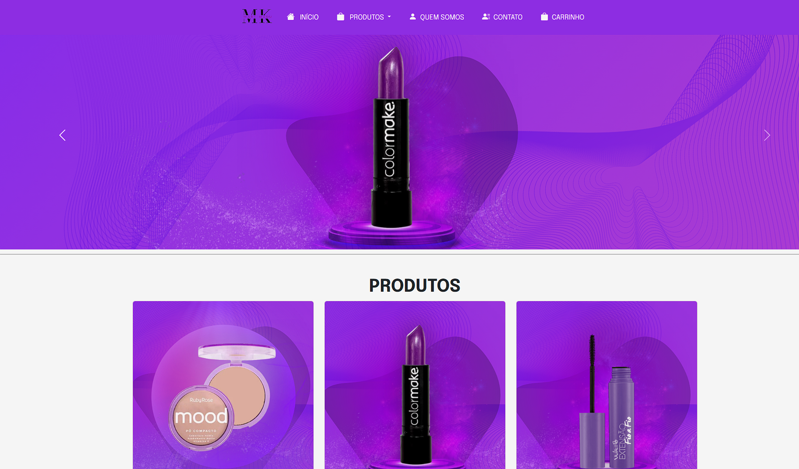
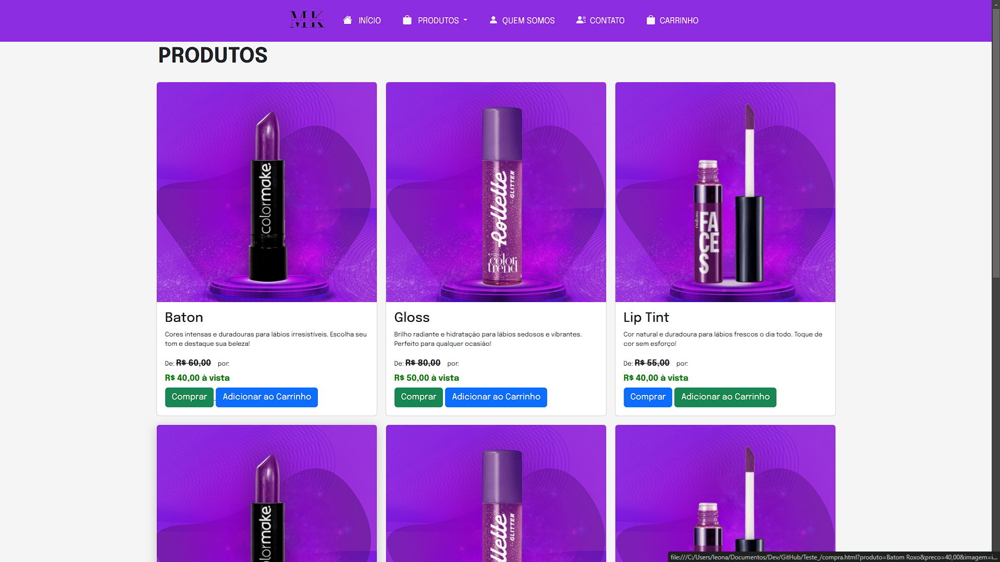
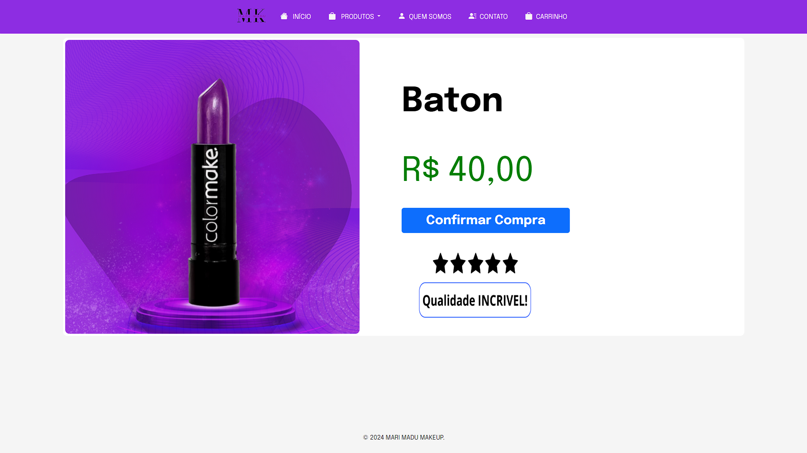
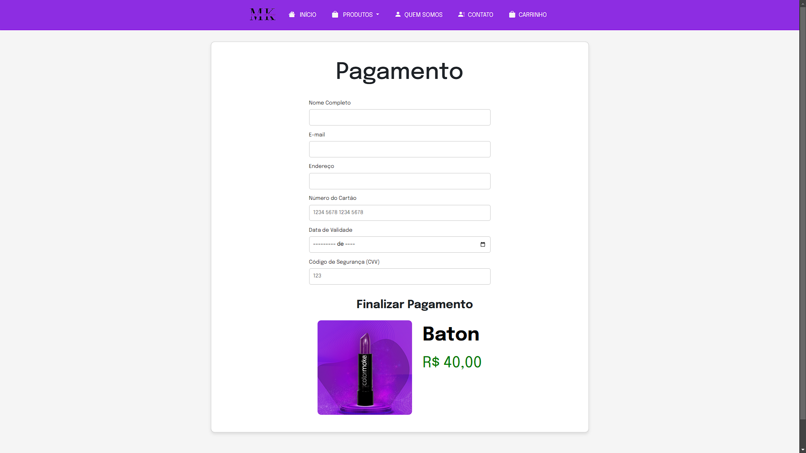
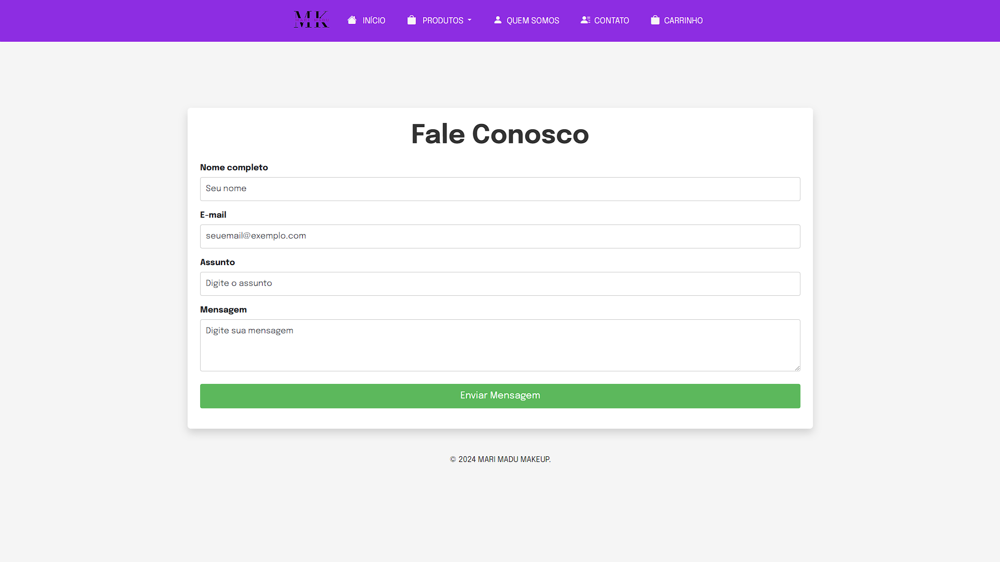

# Mari-Madu Makeup - Projeto de Desenvolvimento de Website
Este repositório contém o código-fonte de um website desenvolvido como atividade prática do curso de Informática e Desenvolvimento Web do SENAI, na unidade curricular de Programação Client-Side.

O projeto foi realizado com base em um briefing e teve como objetivo a criação de um site para uma empresa fictícia de maquiagem chamada Mari-Madu Makeup.

## 📋 Resumo do Projeto
O objetivo deste projeto foi aplicar os conhecimentos adquiridos sobre HTML, CSS e JavaScript para criar um site completo e responsivo. O site da Mari-Madu Makeup apresenta produtos de maquiagem e fornece informações sobre a empresa, permitindo que os usuários conheçam mais sobre os produtos e a marca.
## 🎯 Objetivo da Atividade

#### O projeto foi desenvolvido com o intuito de:

- **Entender o processo de criação de um site desde o briefing até a entrega final.**
- **Praticar habilidades em HTML, CSS e JavaScript para desenvolvimento de interfaces responsivas e dinâmicas.**
- **Aplicar conceitos de design e usabilidade para proporcionar uma experiência agradável ao usuário.**

## 🔖 Estrutura do Projeto

**1 - Página Inicial**- Apresenta um banner e destaques de produtos.
**2 - Página de Produtos** - Lista categorias de produtos como maquiagem para olhos, boca e pele.
**3 - Página Quem Somos** - Descreve a história e a missão da Mari-Madu Makeup.
**4 - Página de Contato** - Oferece um formulário para que os usuários entrem em contato com a empresa

## 🛠️ Tecnologias Utilizadas
- **HTML5 - Estrutura do conteúdo e marcação das páginas.**
- **CSS3 - Estilização e design responsivo do site.**
- **JavaScript - Funcionalidades interativas, como navegação dinâmica e manipulação de DOM.**
- **Bootstrap - Utilizado para facilitar o design responsivo e componentes pré-formatados.**

## 📷 Layout
O layout foi desenvolvido para ser visualmente atraente e fácil de navegar, seguindo o padrão de uma marca de maquiagem moderna. As cores e imagens foram escolhidas com base no público-alvo e no estilo da marca fictícia Mari-Madu Makeup.

## 🚀 Funcionalidades
-**Navegação Intuitiva: Links de navegação fáceis de usar, organizados por categorias.**
-**Responsividade: Design adaptável para diferentes dispositivos, como desktops, tablets e smartphones.**
-**Exibição Dinâmica de Produtos: Uso de JavaScript para exibir informações de produtos de maneira dinâmica.**
-**Formulário de Contato: Formulário funcional para que os usuários possam enviar mensagens para a empresa.**

## 📈 Aprendizados

**Durante o desenvolvimento deste projeto, foram trabalhados conceitos importantes de:**

-**Estruturação de conteúdo em HTML.**
-**Estilização com CSS, incluindo técnicas de responsividade.**
-**Programação client-side com JavaScript, aplicando manipulação do DOM e interatividade.**
-**Integração de bibliotecas como Bootstrap para agilizar o desenvolvimento.**

## 🖥️ Demonstração

## 📞 Contato
Em caso de dúvidas ou sugestões, entre em contato:

-**Email: heringerleonardo560@gmail.com**
